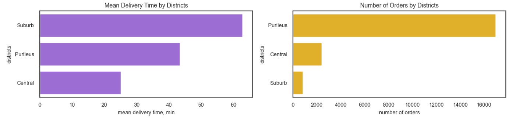

# Pizza Delivery Analysis

###   
*Click above to view the complete data analysis with visualizations and insight*

### 🎯 Objective:
* We work for a large pizza delivery company with separate apps for couriers and customers. In the evening, delivery speed decreases because many couriers leave after their shifts, while order volume keeps growing. This causes a drop in delivery efficiency during shift changes.  
* Data scientists developed a new algorithm that helps couriers plan their last deliveries “on the way” home, so their delivery routes align with their commute.  
* An A/B test divides couriers into two groups: one uses the old algorithm, and the other has access to the new “on the way home” feature.  
* We need to analyze the experiment data and decide whether to roll out the new feature to all courdecision-making.  

### 📊 Dataset:
**Key variables:** order_id, delivery_time, district, experiment_group (A or B)

**Aggregated DataFrame for Analysis:**  
  

### 🛠️ Technologies Used:
Libraries: pandas, numpy, seaborn, matplotlib, scipy.stats, tqdm  

### 📁 Repository Structure:
1. pizza-delivery-analysis.ipynb - working file  
2. pizza_data.csv - dataset   

### 🔍 Analysis Process:  
* Conducted preliminary analysis (EDA) and data preprocessing  
* Average Delivery Time and Number of Orders by District  
* Hypothesis  
* Distribution of delivery time  
* Check for normality  
* T-test  

### 💡 Key Findings:
* There is only a partial inverse relationship between order volume and delivery time, highlighting the importance of both geographic and logistical factors.  
* Across all areas, the Test Group shows reduced delivery times compared to the Control Group. Largest improvements are observed in Purlieus and Central, with Suburb showing modest but positive improvement.  
* Distribution tests indicate the Test Group’s delivery times are non-normal, while the Control Group is normally distributed.  
* An independent t-test confirms that the reduction in delivery time in the Test Group is statistically significant (p ≤ 0.05). This provides strong evidence to reject the null hypothesis of no difference.  
* The intervention effectively reduces delivery times across all districts, with the greatest impact in high-density areas. We are rolling out the new algorithm to everyone, because the average delivery time changed significantly.  

### 📈 Visualizations: 
  

  

  

### 📌 Project Notes:
***This is an educational project for learning data analysis and visualization techniques.***
